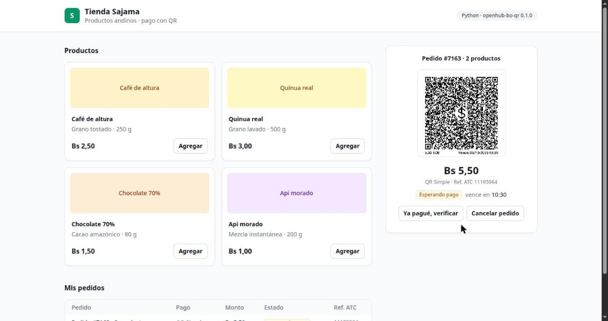
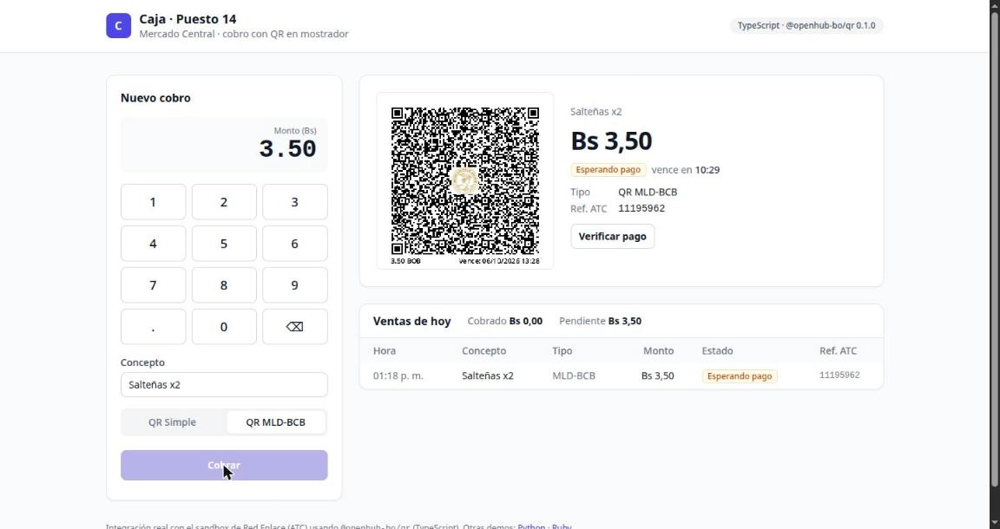
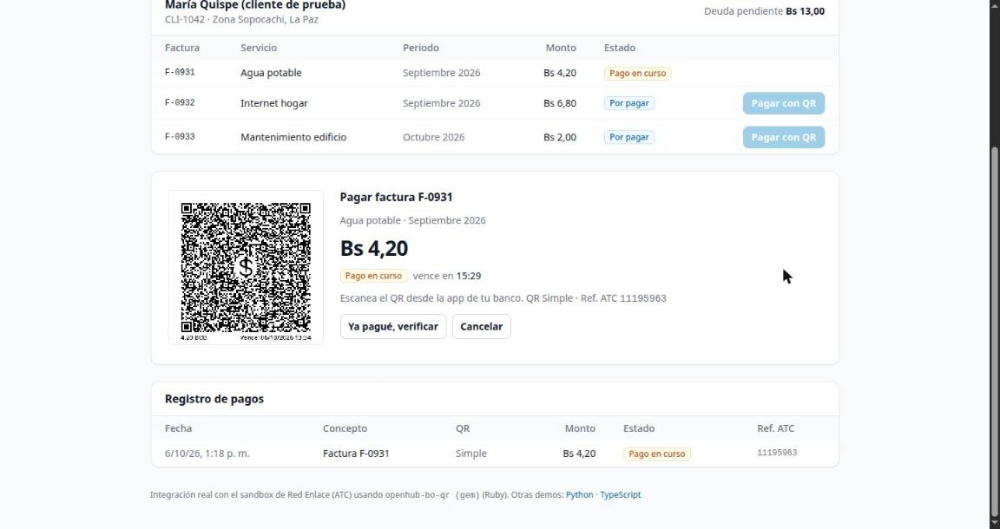
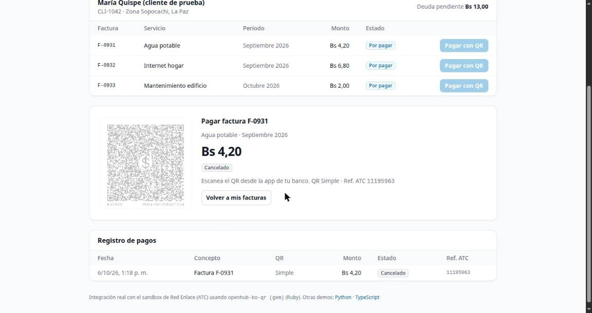
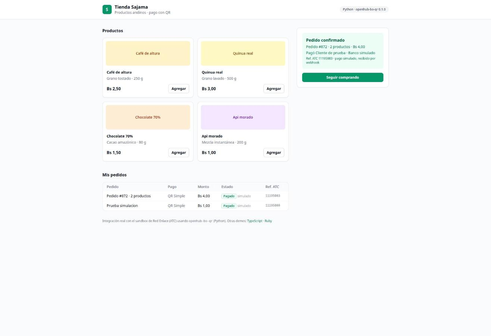
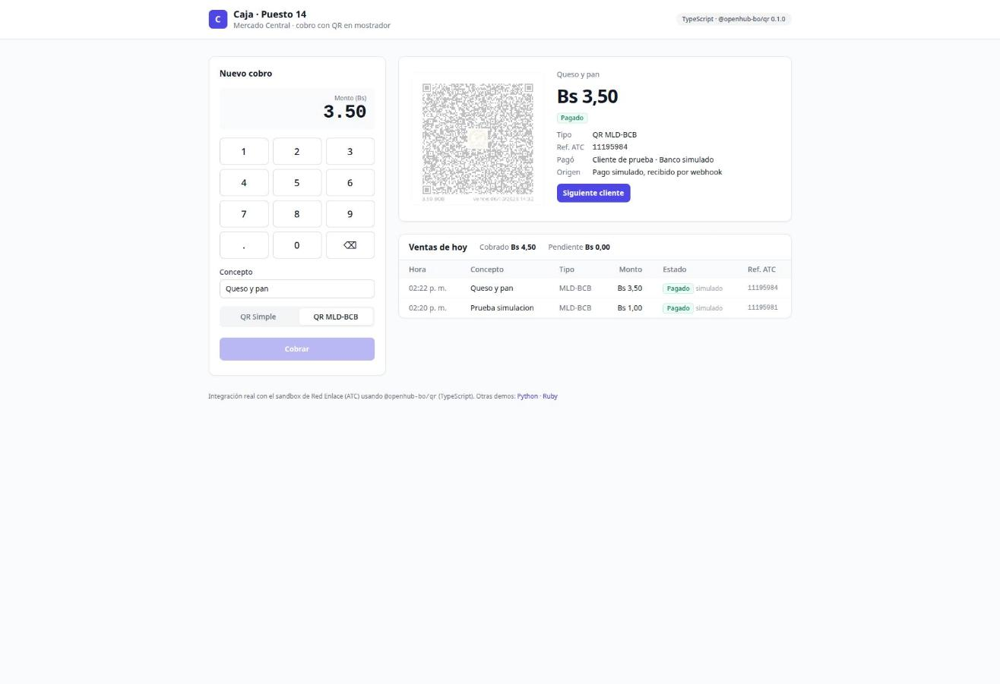
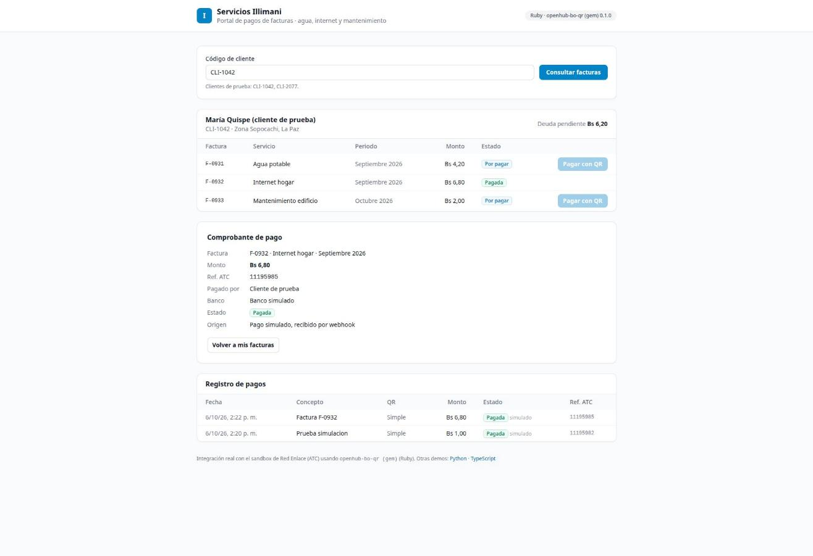
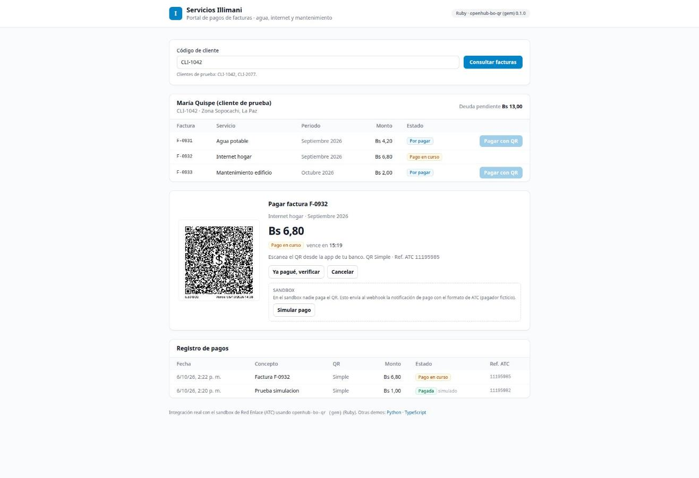

# Demo: tres apps web cobrando con QR Simple y MLD-BCB

Tres aplicaciones de ejemplo, **una por lenguaje**, cada una usando su propia librería
`openhub-bo` contra el **sandbox real de Red Enlace (ATC)**. Muestran lo que se puede
construir con la integración:

| App | Lenguaje / librería | Caso de uso | Puerto |
|---|---|---|---|
| **Tienda Sajama** (`apps/tienda`) | Python · `openhub-bo-qr` | Tienda en línea: carrito → pagar con QR Simple o MLD → pedido confirmado; historial de pedidos | 8101 |
| **Caja · Puesto 14** (`apps/caja`) | TypeScript · `@openhub-bo/qr` | Punto de venta: teclado de monto → QR en pantalla → estado en vivo; ventas del día | 8102 |
| **Servicios Illimani** (`apps/cobros`) | Ruby · gema `openhub-bo-qr` | Portal de pago de facturas: consultar cliente → pagar factura con QR → comprobante | 8103 |

Los nombres de negocios y clientes son ficticios. Interfaz con Tailwind CSS (CDN).

## Evidencia (sandbox, 2026-10-06)

Capturas en [`docs/demo/`](../docs/demo/). Todos los QR, referencias y estados vienen de
OpenHub; no hay datos simulados.

| | |
|---|---|
|  |  |
| **Python** · Tienda: QR Simple de Bs 5,50 generado (ref. ATC 11195964) | **TypeScript** · Caja: QR MLD-BCB de Bs 3,50 (ref. ATC 11195962) |
|  |  |
| **Ruby** · Cobros: QR Simple de la factura F-0931 (ref. ATC 11195963) | **Ruby** · Cancelación real en ATC; la factura vuelve a "Por pagar" |

Más: [ingreso](../docs/demo/01-ingreso.jpg), [tienda con carrito](../docs/demo/02-tienda-carrito.jpg),
[portal de facturas](../docs/demo/05-cobros-facturas.jpg).

### Cierre del flujo: pago simulado por webhook

En el sandbox nadie paga los QR, y OpenHub no ofrece un endpoint para simular el pago. Cada
app trae un botón **Simular pago** (recuadro "Sandbox") que envía la notificación de pago con
el formato de ATC (`fixtures/openhub/webhook_payment.json`, pagador ficticio) a la URL
pública del webhook del QR, por el túnel de Cloudflare y con el header secreto. El servicio
la autentica y la procesa con la librería (`parse_webhook`), igual que un webhook real, y el
pedido, la venta o la factura pasa a **Pagado**, marcado como *simulado*.

| | |
|---|---|
|  |  |
| **Python** · Tienda: pedido de Bs 4,00 confirmado por webhook (ref. ATC 11195983) | **TypeScript** · Caja: QR MLD-BCB de Bs 3,50 pagado (ref. ATC 11195984) |
|  |  |
| **Ruby** · Cobros: comprobante de la factura F-0932 (ref. ATC 11195985) | **Ruby** · QR pendiente con el recuadro "Sandbox" |

Antes de simular: [tienda](../docs/demo/08-tienda-simular.jpg), [caja](../docs/demo/10-caja-simular.jpg).

Qué demuestra y qué no:

- **Sí:** la URL de webhook enviada a ATC es alcanzable desde internet. El servicio exige el
  header secreto (sin él responde 401), la librería interpreta el payload documentado y la
  app reacciona al pago.
- **No:** ATC no sabe del pago simulado. Su consulta de estado sigue diciendo `PENDIENTE`,
  y por eso el servicio no le pide confirmación a ATC en ese caso (con un webhook real sí la
  pide). Falta capturar un webhook enviado por ATC (issue #2).

`POST /api/qr/{kind}/{ref}/simulate` solo acepta QR pendientes de la sesión y exige el
ingreso a la demo.

## Ejecutar

Requisitos: `.env` en la raíz con `CLIENT_ID` y `CLIENT_SECRET`; `cloudflared`; los
bindings compilados (`bindings/python`: `uv sync --all-packages`; `bindings/typescript`:
`pnpm install && pnpm run build:wasm && pnpm -r build`; `bindings/ruby`: `rake`);
`demo/typescript`: `pnpm install`; gemas `webrick` y `erb` (`gem install --user-install
webrick erb`).

```sh
demo/run.sh     # 3 túneles rápidos de Cloudflare + 3 servicios; imprime las 3 URLs
demo/serve.sh   # reinicia solo los servicios, conservando las URLs
```

Los túneles rápidos no modifican tu cuenta ni tu DNS; las URLs `*.trycloudflare.com`
viven mientras corre el script. Clave de acceso en `demo/.run/password` (o `DEMO_PASSWORD`).

## Cómo está hecho

- Cada servicio expone la misma API interna (`/api/qr`, `/api/qr/{kind}/{ref}`,
  `/api/qr/simple/{ref}/cancel`, `/api/qr/{kind}/{ref}/simulate`, `/api/payments`, `/api/events`, `/webhooks/qr/{kind}`)
  y sirve su propia app.
- `/api/payments` guarda los cobros de la sesión y se actualiza al consultar el estado y
  al recibir webhooks.
- Cada servicio publica su URL de webhook y la autentica con un secreto aleatorio.

## Seguridad

- Página de ingreso con cookie de sesión por app (los navegadores comparten cookies entre
  puertos de `localhost`); la API acepta también autenticación básica para scripts.
- Webhooks autenticados con el header secreto configurado al generar cada QR.
- Monto máximo Bs 10. Solo sandbox.
- Errores de OpenHub con HTTP 422: Cloudflare reemplaza las respuestas 502 del origen.

## Lo que la demo dejó al descubierto

- `nombreEstablecimiento` solo admite letras, números y espacios (PR #21).
- La referencia del comercio debe ser ≤ 2.147.483.647 (entero de 32 bits).
